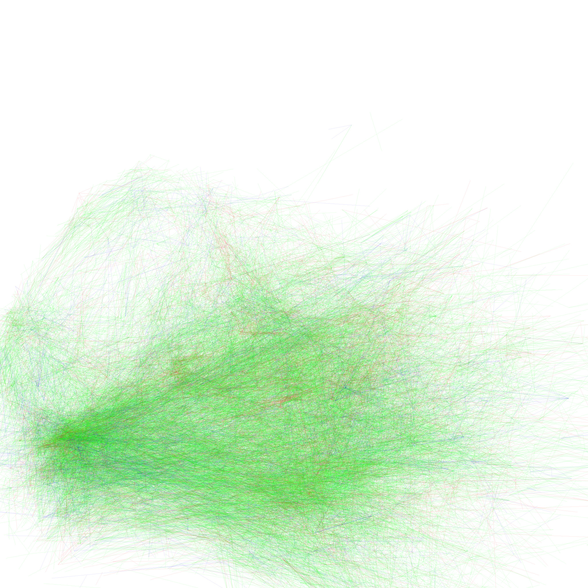

# Graph Shaders for Visualizing Large Graphs

This repository contains the code to visualize large graphs using Graph Shader
Programs (`.GSP`).

The Graph Shaders (GS) system architecture is comprised of three main pieces:

- The GS Engine is a C++ program that loads graph data from disk and configures
  OpenGL to render specially designed shaders.

- The GS Transpiler is a Python program that parses `.GSP` programs and is
  configured using `#pragma` statements.

- The GS Server is a Python program that provides an HTTP API to render graphs
  from a web browser.

The remainder of this repository is a set of example scripts.

## Building

In the simplest case, the GS Engine can be compiled using CMake like any other
CMake program.

```console
$ cmake -Bbuild
$ cmake --build build
$ cmake --install build
```

We also provide a Dockerfile for making setup easier. It can be accessed
directly by calling `docker`, but we also have a helper script `go.sh` that
simplifies some of the repeated arguments.

```console
$ ./go.sh docker build
$ ./go.sh docker start
$
$ ./go.sh docker exec ./go.sh gs configure
$ ./go.sh docker exec ./go.sh gs build
$ ./go.sh docker exec ./go.sh gs install
```

## Examples

We provide several example GS Programs. The data can be downloaded from our
server.

```console
$ wget -O examples/JS-Deps/JS-Deps.data.tar.gz https://accona.eecs.utk.edu/JS-Deps.data.tar.gz
$ wget -O examples/SO-Answers/SO-Answers.data.tar.gz https://accona.eecs.utk.edu/SO-Answers.data.tar.gz
$ wget -O examples/NBER-Patents/NBER-Patents.data.tar.gz https://accona.eecs.utk.edu/NBER-Patents.data.tar.gz
$
$ (cd examples/JS-Deps && tar xvf JS-Deps.data.tar.gz)
$ (cd examples/SO-Answers && tar xvf SO-Answers.data.tar.gz)
$ (cd examples/NBER-Patents && tar xvf NBER-Patents.data.tar.gz)
```

If you are using our `go.sh` scripts, then you can execute our example scripts:

```console
$ ./go.sh docker exec ./go.sh gs exec ./examples/JS-Deps/JS-Deps.sh
$ ./go.sh docker exec ./go.sh gs exec ./examples/SO-Answers/SO-Answers.sh
$ ./go.sh docker exec ./go.sh gs exec ./examples/NBER-Patents/NBER-Patents.sh
```

Otherwise, you should make sure that GraphShaderEngine and
GraphShaderTranspiler.py are within your path.

### Example: JS-Deps


### Example: SO-Answers


### Example: NBER-Patents




## Running the GS Server

The GS Server requires the `flask` and `flask-cors` libraries to be installed.

These can be installed using:

```console
$ ./go.sh docker exec ./go.sh gs exec python3 -m virtualenv venv
$ ./go.sh docker exec ./go.sh gs exec venv/bin/python3 -m pip install flask flask-cors
```

The server is designed to only load one dataset at a time. This functionality is
based on replacing the GS Transpiler executable that the server calls, to a
shell script that calls the GS Transpiler with some file paths.

```console
$ ./go.sh docker exec ./go.sh gs exec venv/bin/python3 -u src/GraphShaderServer.py --gst-executable ./examples/JS-Deps/JS-Deps.sh
```

Running the server outside of a Docker environment is left as an exercise to the
reader 😅

Two frontends are provided for the GS Server.

- A very simplistic HTML page in `src/index.html` that renders a single image
  tile at a time from the text box on the page.

- A more advanced library in the ObservableHQ notebook environment that supports
  stitching multiple tiles into a single image.
  [Available here](https://observablehq.com/@player1537/graph-shaders)
